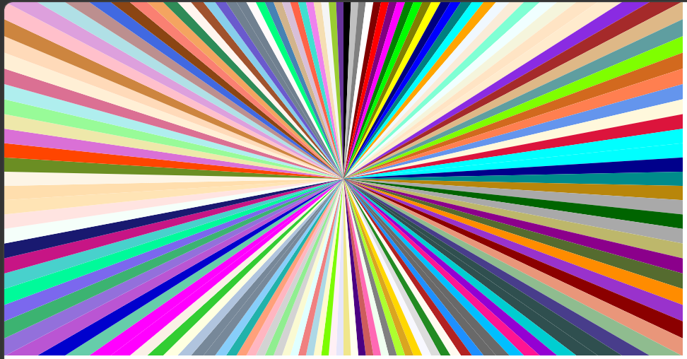
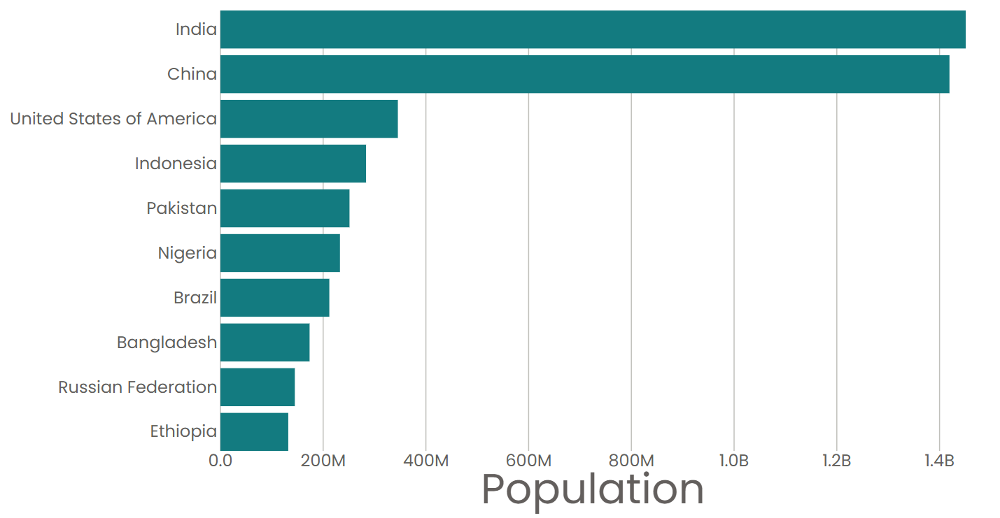
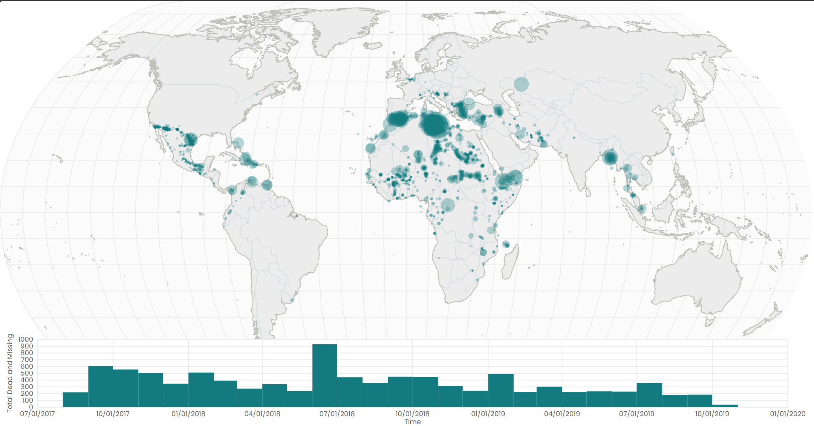
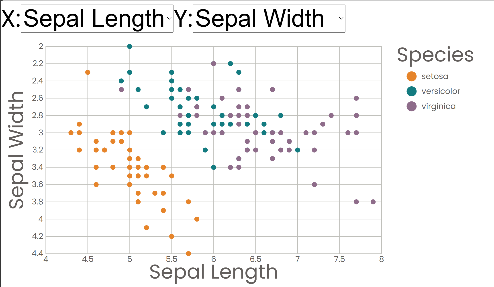
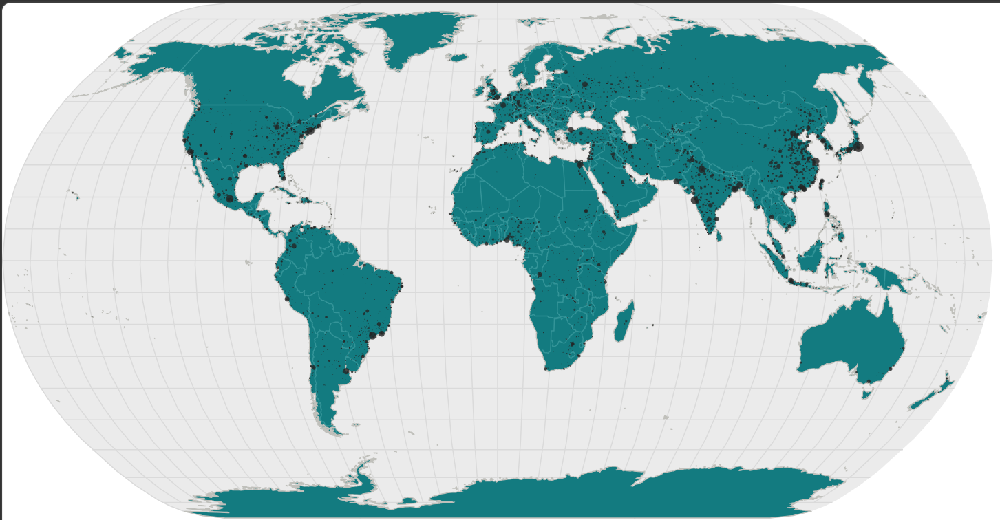

# Data Visualization with React & D3

本仓库是跟随 [Curran Kelleher](https://www.youtube.com/c/CurranKelleher) 的 React + D3 数据可视化课程做下的 7 个小练习。每个练习都聚焦一个具体的技术点，从最简单的 SVG 组件开始，逐步过渡到真实数据集、组件化、交互与地理可视化。

技术栈：

- **React** — 组件化 UI 与状态管理
- **D3** — 数据转换、比例尺、路径生成与地理投影
- **Vite** — 04 开始用于现代 React 项目脚手架

---

## 目录

1. [01 Smiley Faces](#01-smiley-faces)
2. [02 Data Preparation](#02-data-preparation)
3. [03 Bar Chart](#03-bar-chart)
4. [04 Bar Chart 2](#04-bar-chart-2)
5. [05 Missing Migrants](#05-missing-migrants)
6. [06 Scatter Plot](#06-scatter-plot)
7. [07 World Map](#07-world-map)

---

## 01. Smiley Faces


第一个练习，用 React 组件拼装 SVG 笑脸：

- 把 `BackgroundCircle`、`Eyes`、`Mouth` 拆成独立函数组件
- 用 `d3.arc()` 生成嘴巴的弧线
- 生成 18 个随机参数的笑脸，练习 props 传递

> 运行方式：直接在浏览器中打开 `01_smily_faces/smily_face.html`

---

## 02. Data Preparation



这一节包含三个小示例，分别对应 React 交互、D3 数据加载、以及把数据交给 React 渲染：

| 子目录 | 内容 |
|--------|------|
| `1_interaction_with_React` | 在 `<svg>` 上监听 `onMouseMove`，让圆跟随鼠标移动 |
| `2_data_with_d3` | 用 `d3.csv()` 加载 CSV，统计文件大小、行数、列数 |
| `3_data_with_React` | 加载 CSS 命名颜色表，用 `d3.pie()` 与 `d3.arc()` 绘制成饼图 |

> 运行方式：直接打开各子目录下的 `index.html`

---

## 03. Bar Chart

第一个真正的数据图表：

- 从联合国人口数据 CSV 中读取 2024 年人口
- 取人口最多的前 10 个国家
- 用 `d3.scaleBand()` 与 `d3.scaleLinear()` 绘制横向条形图
- 手写坐标轴刻度线与标签

> 运行方式：直接打开 `03_bar_chart/index.html`

---

## 04. Bar Chart 2



在 03 的基础上，用 Vite 重构为现代 React 项目：

- 自定义 Hook `useData` 负责异步加载 CSV
- 拆分为 `AxisBottom`、`AxisLeft`、`Marks` 等组件
- 人口坐标轴使用 SI 格式（`1.4B`、`600M` 等）
- 为条形添加 tooltip 提示

> 运行方式：
> ```bash
> cd 04_bar_chart_2
> npm install
> npm run dev
> ```

---

## 05. Missing Migrants



第一个交互式联动可视化：

- 上方是世界气泡地图，每个气泡代表一起移民失踪/死亡事件
- 下方是时间直方图，展示事件随时间的分布
- 在时间轴上刷选（brush）时，地图只显示选中时间段内的事件
- 使用 TopoJSON 绘制国家边界，用 `d3.geoPath()` 渲染

> 运行方式：
> ```bash
> cd 05_missing_migrants
> npm install
> npm run dev
> ```

---

## 06. Scatter Plot



经典的鸢尾花（Iris）数据集散点图：

- 通过下拉菜单任意选择 X 轴与 Y 轴的属性（花萼/花瓣长宽）
- 用 `d3.scaleOrdinal()` 按物种着色
- 图例支持 hover 高亮某一物种，其余点变淡
- 练习 React 状态与 D3 比例尺的配合

> 运行方式：
> ```bash
> cd 06_scatter_plot
> npm install
> npm run dev
> ```

---

## 07. World Map



地理可视化入门：

- 使用 `d3.geoNaturalEarth1` 自然地球投影
- 绘制球体、经纬网、国家陆地与边界线
- 用城市数据集在世界地图上标出主要城市
- 城市圆圈大小按人口进行 `scaleSqrt` 比例缩放

> 运行方式：
> ```bash
> cd 07_world_map
> npm install
> npm run dev
> ```

